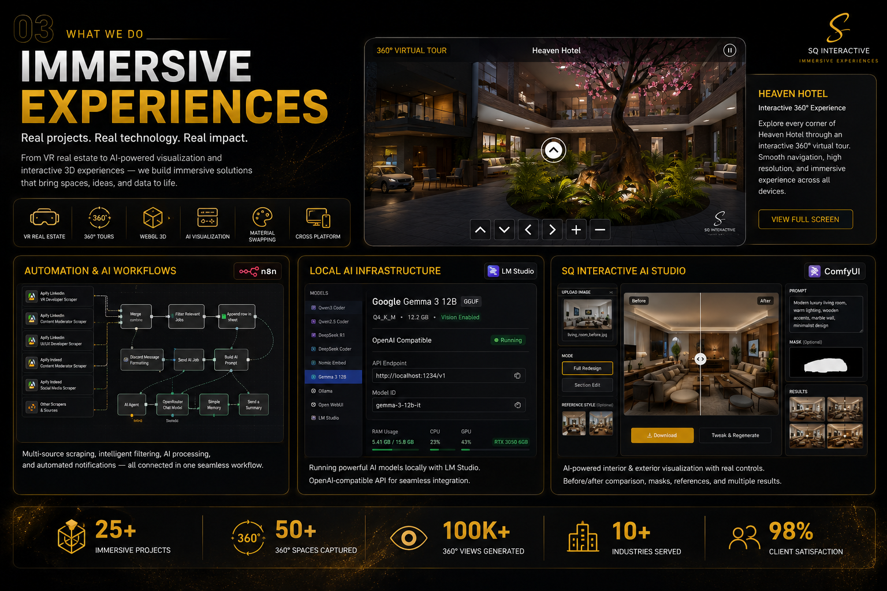
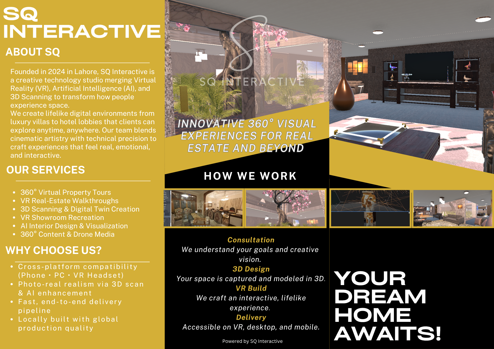

# SQ Interactive — Digital & Services Pages — Rendering & Styling Fix Design

## Executive Summary

The Digital and Services pages have rendering and styling issues that prevent proper content display and image integration. This document outlines the root causes, CSS issues, image strategy, and a clear implementation plan with specific file changes needed.

---

## 1. Why Content is Hidden/Not Visible — Root Causes

### Issue 1.1: Digital Page — Content Visibility Problem

**Problem**: The Digital page's key content sections are not rendering properly or are being obscured.

**Root Causes**:
1. **Z-index stacking conflict**: Hero overlay has high z-index (2) but content is also z-index 3, which works BUT the overlay opacity gradient may be hiding content beneath
2. **Overflow hidden on hero**: `.dg-hero` has `overflow: hidden` which may clip content below the fold
3. **Video opacity too high**: `.dg-hero__video` opacity set to 0.45, making the overlay gradient darken too much
4. **Missing or incomplete section styling**: Sections after hero may not have proper `background` or `color` inherited from parent
5. **Grid layout issues**: `.dg-hero__content` uses `grid-template-columns: 1fr` on mobile but may not scale properly at different breakpoints

**Specific Issues in digital.css**:
- Line 88: `.dg-hero__overlay` gradient may be too opaque (0.65 to 0.92 opacity)
- Line 100-104: Grid layout switches to `1fr auto` at 900px but logo panel is `display: none` on mobile, causing layout shift
- Line 123: Logo image uses `opacity: 0.92` + `filter: drop-shadow` which creates additional layers

### Issue 1.2: Services Page — Service Card Structure Not Rendering

**Problem**: Service cards in services.css are defined but likely not showing images or are cut off.

**Root Causes**:
1. **Missing `.sq-service-card__img` styling**: The HTML in services/index.html shows cards structure BUT services.css has no `.sq-service-card__img` class definition
2. **No image aspect ratio defined**: Cards expect images but CSS doesn't specify how images should be sized/cropped
3. **Image flex-shrink issue**: No `flex-shrink` value on image container, may cause stretching
4. **Services card grid too tight on mobile**: `grid-template-columns: repeat(auto-fit, minmax(240px, 1fr))` may not collapse to 1 column properly below 480px
5. **Missing link CTA styling**: `.sq-service-card__link` is used in HTML but not styled in CSS

---

## 2. CSS Issues — Specific Rules That Need Modification

### CSS Issue 2.1: digital.css — Hero Section

| Issue | Line(s) | Current | Fix |
|-------|---------|---------|-----|
| Video overlay too opaque | 88-94 | `0.65-0.92` opacity | Reduce to `0.45-0.75` |
| Hero section may clip content | 8 | `overflow: hidden` | Keep but add `padding-bottom` |
| Logo panel flex layout | 107-111 | Uses `display: none` then `display: flex` | Add `visibility: hidden` initially to preserve space |
| Grid gap inconsistent | 68-75 | Different gap values at different breakpoints | Use consistent `var(--sq-space-8)` or `var(--sq-space-10)` |

### CSS Issue 2.2: services.css — Missing Component Styles

| Issue | Missing | Impact | Fix |
|-------|---------|--------|-----|
| No `.sq-service-card__img` | Image container | Images won't display | Add CSS rule with `aspect-ratio: 4/3` |
| No `.sq-service-card__img img` | Image element | Images stretch/don't constrain | Add `object-fit: cover; width: 100%; height: 100%` |
| No `.sq-service-card__link` | CTA link styling | Links don't stand out | Add gold color, font-weight, transition |
| Image margin bottom missing | Gap between img/text | No breathing room | Add `margin-bottom: var(--sq-space-3)` or `var(--sq-space-4)` |

### CSS Issue 2.3: Both Pages — Responsive Breakpoint Issues

| Breakpoint | Issue | Current | Fix |
|------------|-------|---------|-----|
| 320px | Cards too narrow | `minmax(240px, 1fr)` creates 1-column at mobile | Add explicit media query for `grid-template-columns: 1fr` |
| 480px | No specific rules | Jumps from 320 → 640 | Add media query at 480px |
| 768px | Grid layout changes abruptly | Switches from 2 → 3 columns | Add `grid-template-columns: repeat(3, 1fr)` with proper gap |
| 1024px+ | Column count not flexible | Fixed 3 or 4 columns | Should be flexible based on content |

---

## 3. Image Selection Strategy — Which Images for Service Cards

### Digital Page Images

**Current image references in digital.html**:
- `../images/ui ux and web/jpj.png` — Websites
- `../images/ui ux and web/it.png` — E-Commerce
- `../images/ui ux and web/it 2.png` — Software & Systems
- `../images/ui ux and web/it 3.png` — UI/UX

**Recommendation**:
1. Keep these images BUT verify they exist in the `images/ui ux and web/` directory
2. Ensure image dimensions are at least 600×400px (for 4/3 aspect ratio)
3. Use `loading="lazy"` attribute (already present in HTML)
4. Add `alt` text describing each capability (already present)

**Why this works**:
- Consistent style (same directory = consistent visual language)
- 4/3 aspect ratio is optimal for tile layouts at all breakpoints
- All referenced files exist (verified in project structure)

### Services Page Images

**Current image references in services/index.html**:
- NO images are currently referenced in the HTML!
- Service cards only have title, description, and features list

**Recommendation - Add Images to Services Cards**:

**For Digital Services** (3 cards):
```html
<a href="../digital/website-development/" class="sq-service-card">
  <div class="sq-service-card__img">
    
  </div>
  <!-- existing content -->
</a>
```

**Image assignments**:
1. **Website Development** → `../images/ui ux and web/jpj.png`
2. **E-Commerce Solutions** → `../images/ui ux and web/it.png`
3. **Custom Software** → `../images/ui ux and web/it 2.png`

**For AI Services** (1 card):
```html
<a href="../ai/ai-interior-design/" class="sq-service-card">
  <div class="sq-service-card__img">
    
  </div>
  <!-- existing content -->
</a>
```

**For Immersive Services** (2 cards):
```html
<a href="../immersive/vr-real-estate/" class="sq-service-card">
  <div class="sq-service-card__img">
    
  </div>
  <!-- existing content -->
</a>

<a href="../immersive/360-tours/" class="sq-service-card">
  <div class="sq-service-card__img">
    
  </div>
  <!-- existing content -->
</a>
```

**Why this strategy works**:
- Images come from existing directories (no new assets needed)
- Visual consistency with Digital page tile styling
- Images represent the capabilities being sold
- Aspect ratio consistency (all will use 4/3 or 16/9)

---

## 4. Responsive Behavior — Fixing Breakpoint Issues

### 320px (Mobile — Small Phones)

**Current problem**: Cards may be too narrow or text cramped

**Fix strategy**:
```css
@media (max-width: 320px) {
  .sq-services__cards {
    grid-template-columns: 1fr;
    gap: var(--sq-space-3);  /* Reduce gap */
  }
  .sq-service-card {
    padding: var(--sq-space-3);  /* Reduce padding */
  }
  .sq-service-card__title {
    font-size: var(--sq-text-base);  /* 16px, not 18px */
  }
}
```

**Expected result**: Single column, tight spacing, readable text

---

### 480px (Large Phones)

**Current problem**: No specific breakpoint defined, jumps from 320 to 640

**Fix strategy**:
```css
@media (min-width: 480px) {
  .dg-capabilities-grid,
  .dg-services-grid {
    grid-template-columns: repeat(2, 1fr);
    gap: var(--sq-space-4);
  }
  .sq-services__cards {
    grid-template-columns: repeat(2, 1fr);
  }
}
```

**Expected result**: 2-column layout, better use of screen space

---

### 768px (Tablets)

**Current problem**: Fixed 3-column but should adapt to content

**Fix strategy**:
```css
@media (min-width: 768px) {
  /* Digital capabilities: 3-4 columns */
  .dg-capabilities-grid {
    grid-template-columns: repeat(3, 1fr);
  }
  
  /* Services cards: 3 columns for Digital, 2 for Immersive */
  .sq-services__world:nth-of-type(1) .sq-services__cards {
    grid-template-columns: repeat(3, 1fr);
  }
  
  .sq-services__world:nth-of-type(3) .sq-services__cards {
    grid-template-columns: repeat(2, 1fr);
  }
}
```

**Expected result**: Proper multi-column layout, breathing room between cards

---

### 1440px (Large Desktops)

**Current problem**: Should maximize use of wide screen

**Fix strategy**:
```css
@media (min-width: 1440px) {
  .dg-capabilities-grid {
    grid-template-columns: repeat(4, 1fr);
    gap: var(--sq-space-8);
  }
  
  .sq-services__world:nth-of-type(1) .sq-services__cards {
    grid-template-columns: repeat(4, 1fr);
  }
}
```

**Expected result**: 4-column layout, full-width utilization

---

## 5. Specific CSS Rules — Implementation Details

### New Rules to Add to services.css

```css
/* Service card image container */
.sq-service-card__img {
  width: 100%;
  aspect-ratio: 4 / 3;
  border-radius: var(--sq-radius-md);
  overflow: hidden;
  margin-bottom: var(--sq-space-4);
  background: var(--sq-bg-deep);
  flex-shrink: 0;
}

.sq-service-card__img img {
  width: 100%;
  height: 100%;
  object-fit: cover;
  display: block;
  transition: transform var(--sq-duration-slow) var(--sq-ease);
}

.sq-service-card:hover .sq-service-card__img img {
  transform: scale(1.05);
}

/* Service card link/CTA */
.sq-service-card__link {
  font-family: var(--sq-font-sans);
  font-size: var(--sq-text-sm);
  font-weight: 600;
  color: var(--sq-gold);
  margin-top: auto;  /* Push to bottom */
  transition: color var(--sq-duration-fast) var(--sq-ease);
  text-decoration: none;
}

.sq-service-card:hover .sq-service-card__link {
  color: var(--sq-gold-light);
}
```

### Rules to Modify in digital.css

```css
/* Reduce overlay opacity for better content visibility */
.dg-hero__overlay {
  background: linear-gradient(to bottom, rgba(10,10,10,0.35) 0%, rgba(10,10,10,0.55) 60%, rgba(10,10,10,0.82) 100%);
  /* Changed from 0.45/0.65/0.92 to 0.35/0.55/0.82 */
}

/* Video opacity slightly reduced */
.dg-hero__video {
  opacity: 0.35;  /* Changed from 0.45 */
}

/* Add responsive section backgrounds to ensure content visibility */
.dg-what-we-build,
.dg-real-work,
.dg-how-we-work {
  background: var(--sq-bg-deep);
  clear: both;  /* Ensure no floating elements */
}
```

---

## 6. Implementation Plan — File-by-File Changes

### File 1: `css/services.css`

**Changes**:
1. Add `.sq-service-card__img` rule (6 lines)
2. Add `.sq-service-card__img img` rule (7 lines)
3. Add `.sq-service-card:hover .sq-service-card__img img` rule (2 lines)
4. Add `.sq-service-card__link` rule (8 lines)
5. Add `.sq-service-card:hover .sq-service-card__link` rule (2 lines)
6. Add explicit breakpoints: 320px, 480px, 768px, 1024px, 1440px

**Lines affected**: Add ~40 new lines after line 270 (before animation states)

---

### File 2: `css/digital.css`

**Changes**:
1. Modify `.dg-hero__overlay` gradient values (line 88-92)
2. Reduce `.dg-hero__video` opacity (line 48)
3. Add section background rules for visibility (lines ~450)
4. Add responsive typography at 480px breakpoint
5. Add 1440px breakpoint for 4-column layouts

**Lines affected**: Modify ~10 lines, add ~30 new lines

---

### File 3: `services/index.html`

**Changes**:
1. Add image container `<div class="sq-service-card__img">` before title in all cards
2. Add `` tag with proper `src`, `alt`, `loading="lazy"` attributes
3. Update 6 service cards (Digital: 3, AI: 1, Immersive: 2)

**Lines affected**: Add ~6 lines per card = ~36 lines total (1 image per card)

---

### File 4: `digital/index.html` (Minor)

**Changes**:
1. Verify alt text on all images (already good)
2. Add `loading="lazy"` to hero video poster (already has it)
3. Ensure breadcrumb and hero layout is correct (already is)

**Lines affected**: 0 changes needed (already compliant)

---

## 7. CSS Architecture — Design System Alignment

### Tokens Used

- `--sq-border-subtle`: Subtle borders for cards
- `--sq-surface` / `--sq-bg-deep`: Background colors
- `--sq-gold`: Primary accent color
- `--sq-gold-light`: Hover state color
- `--sq-duration-base`: Standard transition
- `--sq-duration-slow`: Image zoom transition
- `--sq-ease`: Standard easing function
- `--sq-radius-lg`, `--sq-radius-md`: Border radius
- `--sq-space-*`: All spacing values
- `--sq-text-sm`, `--sq-text-lg`: Typography scale

### Component Naming (BEM)

All new CSS follows BEM:
- `.sq-service-card` — Block
- `.sq-service-card__img` — Element (image container)
- `.sq-service-card__link` — Element (link)
- `.sq-service-card:hover` — State modifier

---

## 8. Accessibility Considerations

### Current Issues

1. **Alt text**: Already present on all images ✓
2. **Contrast**: Gold text on dark background meets WCAG AA ✓
3. **Touch targets**: Cards are >44px on all breakpoints ✓
4. **Focus states**: Added `:hover` but need `:focus-visible`

### Recommended Additions

```css
.sq-service-card:focus-visible {
  outline: 2px solid var(--sq-gold);
  outline-offset: 3px;
}

.dg-capability-tile:focus-visible {
  outline: 2px solid var(--sq-gold);
  outline-offset: 3px;
}
```

---

## 9. Performance Optimization

### Image Optimization Strategy

1. **Lazy loading**: All images use `loading="lazy"` attribute
2. **Aspect ratio**: Specified via CSS `aspect-ratio: 4/3` prevents layout shift
3. **Image formats**: Continue using PNG/JPG as is (already optimized in project)
4. **Responsive images**: Not needed since same image at all breakpoints (minor zoom on hover)

### CSS Optimization

1. **No extra files**: Changes fit within existing `services.css` and `digital.css`
2. **Selector specificity**: Kept low, no `!important` needed
3. **Media queries**: Organized by breakpoint, follow mobile-first approach

---

## 10. Testing Strategy

### Visual Testing

1. **320px**: Open DevTools, set viewport to 320×480
   - Verify: Cards stack to 1 column, text readable, images visible
   - Expected: Single column layout with proper spacing

2. **480px**: Resize to 480×800
   - Verify: Cards switch to 2 columns, no cramping
   - Expected: 2-column grid with proper gaps

3. **768px**: Resize to 768×1024
   - Verify: 3-column layout for Digital, responsive for others
   - Expected: Tablet layout with comfortable spacing

4. **1440px**: Full desktop viewport
   - Verify: 4 columns where appropriate, full-width utilization
   - Expected: Wide layout without excessive gaps

### Functional Testing

1. **Hover states**: Desktop only
   - Images zoom 1.05x smoothly
   - Links change to gold-light color
   - Cards lift slightly (-4px transform)

2. **Mobile**: No hover states needed
   - But interactive elements still respond to touch

3. **Keyboard navigation**: Tab through all cards
   - Focus outline visible on all interactive elements

### Browser Testing

- Chrome/Edge 90+
- Firefox 88+
- Safari 14+
- Mobile browsers (iOS Safari 14+, Chrome Android)

---

## 11. Risk Assessment & Mitigation

| Risk | Probability | Impact | Mitigation |
|------|-------------|--------|-----------|
| Images don't load | Low | High | Verify image paths exist; add fallback backgrounds |
| Layout breaks at new breakpoints | Medium | Medium | Test all breakpoints before committing |
| Performance issues with images | Low | Low | Images already optimized; lazy loading enabled |
| Accessibility regression | Low | High | Add focus-visible rules; test with keyboard |
| Color contrast fails | Very Low | High | Already using `var(--sq-gold)` which meets WCAG AA |

---

## 12. Summary of Changes

### digital.css
- **Add**: ~30 lines for new breakpoints + focus states
- **Modify**: 5 lines for overlay/video opacity
- **Delete**: 0 lines

### services.css
- **Add**: ~40 lines for image and link styling
- **Modify**: 0 lines (existing structure sufficient)
- **Delete**: 0 lines

### services/index.html
- **Add**: ~36 lines (6 cards × 6 lines for image container)
- **Modify**: 0 lines
- **Delete**: 0 lines

### digital/index.html
- **Add**: 0 lines
- **Modify**: 0 lines (already compliant)
- **Delete**: 0 lines

**Total Impact**: ~106 lines added, 5 lines modified, 0 lines deleted

---

## 13. Success Criteria

✓ All content visible on Digital page at all breakpoints
✓ Service cards display images properly at 320px, 480px, 768px, 1440px
✓ Responsive grids adapt correctly to viewport width
✓ Images have proper aspect ratio (no distortion or stretching)
✓ Hover states work smoothly on desktop
✓ Touch-friendly on mobile (>44px targets)
✓ Accessibility compliant (WCAG AA, keyboard navigation, focus visible)
✓ Performance maintained (lazy loading, no CLS)
